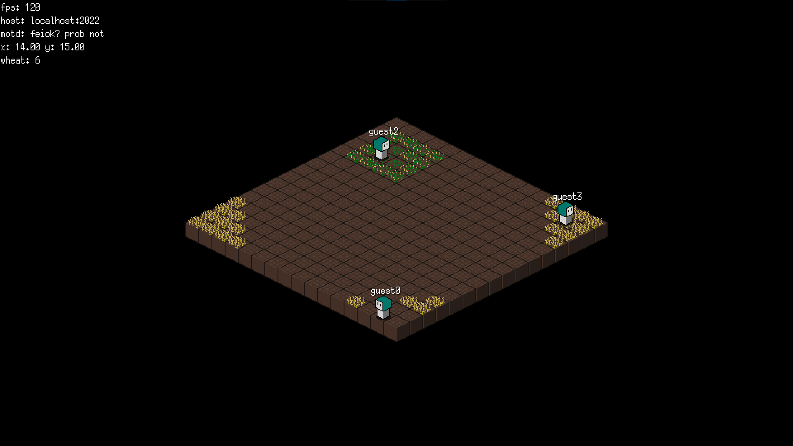

A vibrant, isometric, multiplayer-centric farming game written in Go.

## Progress



*Note: may show an outdated state of development.*

## TODO

### Game

- Introduce wheat harvesting.
- Introduce a UI library (title screen, inventory, etc.).
- Introduce more player interaction mechanics.

### Implementation

- Introduce scaling and full screen.
- Safer game and server implementation (and more correct error handling).

## Project

- `game` - the game assets and code
- `packet` - a packet manipulation library and protocol constants
- `server` - the protocol implementation
- `try` - a tiny helper function to avoid verbose error handling

## Building

Using the Go build system is highly encouraged. Not before cloning the repository!

```sh
git clone https://github.com/dacousb/feiok
cd feiok
go build
```

## Running

Run the generated binary by the *building* step, or use the built-in Go command.

```sh
go run . -help
```

## About the name

I simply slammed on my keyboard.

## License

[MIT](LICENSE).
